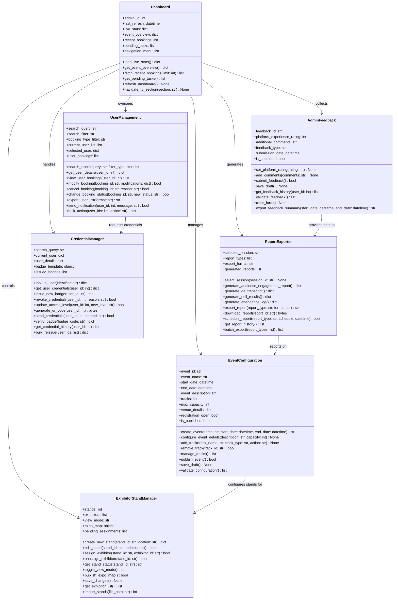

# AdminControlCentre UML Class Diagram

## ASCII Art Class Diagram

```
+--------------------------------+              +--------------------------------+
|           Dashboard            |              |      EventConfiguration        |
+--------------------------------+              +--------------------------------+
| + admin_id: int                |              | + event_id: str                |
| + last_refresh: datetime       |              | + event_name: str              |
| + live_stats: dict             |              | + start_date: datetime         |
| + event_overview: dict         |              | + end_date: datetime           |
| + recent_bookings: list        |              | + event_description: str       |
| + pending_tasks: list          |              | + tracks: list                 |
| + navigation_menu: list        |              | + max_capacity: int            |
+--------------------------------+              | + venue_details: dict          |
| + load_live_stats(): dict      |              | + registration_open: bool      |
| + get_event_overview(): dict   |              | + is_published: bool           |
| + fetch_recent_bookings(): list|              +--------------------------------+
| + get_pending_tasks(): list    |              | + create_event(): str          |
| + refresh_dashboard(): None    |              | + configure_event_details()    |
| + navigate_to_section(): None  |              | + add_track(): None            |
+--------------------------------+              | + remove_track(): bool         |
         |                                      | + manage_tracks(): list        |
         |------------------------------------→ | + publish_event(): bool        |
         |         manages                     | + save_draft(): None           |
         |                                      | + validate_configuration(): list|
         ↓                                      +--------------------------------+
+--------------------------------+              
|        UserManagement          |              +--------------------------------+
+--------------------------------+              |    ExhibitorStandManager       |
| + search_query: str            |              +--------------------------------+
| + search_filter: str           |              | + stands: list                 |
| + booking_type_filter: str     |              | + exhibitors: list             |
| + current_user_list: list      |              | + view_mode: str               |
| + selected_user: dict          |              | + expo_map: object             |
| + user_bookings: list          |              | + pending_assignments: list    |
+--------------------------------+              +--------------------------------+
| + search_users(): list         |              | + create_new_stand(): dict     |
| + get_user_details(): dict     |              | + edit_stand(): bool           |
| + view_user_bookings(): list   |              | + assign_exhibitor(): bool     |
| + modify_booking(): bool       |              | + unassign_exhibitor(): bool   |
| + cancel_booking(): bool       |              | + get_stand_status(): str      |
| + change_booking_status(): bool|              | + toggle_view_mode(): str      |
| + export_user_list(): str      |              | + publish_expo_map(): bool     |
| + send_notification(): bool    |              | + save_changes(): None         |
| + bulk_action(): dict          |              | + get_exhibitor_list(): list   |
+--------------------------------+              | + import_stands(): int         |
         |                                      +--------------------------------+
         |                                                    ↑
         ↓                                                    |
+--------------------------------+                            |
|       CredentialManager        |       EventConfiguration --+
+--------------------------------+       configures stands for
| + search_query: str            |
| + current_user: dict           |              +--------------------------------+
| + user_details: dict           |              |        ReportExporter          |
| + badge_template: object       |              +--------------------------------+
| + issued_badges: list          |              | + selected_session: str        |
+--------------------------------+              | + report_types: list           |
| + lookup_user(): dict          |              | + export_format: str           |
| + get_user_credentials(): dict |              | + generated_reports: list      |
| + issue_new_badge(): str       |              +--------------------------------+
| + revoke_credentials(): bool   |              | + select_session(): None       |
| + update_access_level(): bool  |              | + generate_engagement_report() |
| + generate_qr_code(): bytes    |              | + generate_qa_transcript()     |
| + send_credentials(): bool     |              | + generate_poll_results()      |
| + verify_badge(): dict         |              | + generate_attendance_log()    |
| + get_credential_history(): list|             | + export_report(): str         |
| + bulk_reissue(): dict         |              | + download_report(): bytes     |
+--------------------------------+              | + schedule_report(): bool      |
                                                | + get_report_history(): list   |
UserManagement --> CredentialManager           | + batch_export(): list         |
    requests credentials                       +--------------------------------+
                                                              ↑
+--------------------------------+                            |
|        AdminFeedback           |                            |
+--------------------------------+                            |
| + feedback_id: str             |                            |
| + platform_experience_rating   |                            |
| + additional_comments: str     |                            |
| + feedback_type: str           |                            |
| + submission_date: datetime    |                            |
| + is_submitted: bool           |                            |
+--------------------------------+                            |
| + set_platform_rating(): None  |                            |
| + add_comments(): None         |                            |
| + submit_feedback(): bool      |                            |
| + save_draft(): None           |                            |
| + get_feedback_history(): list |                            |
| + validate_feedback(): list    |                            |
| + clear_form(): None           |                            |
| + export_feedback_summary(): str|---------------------------+
+--------------------------------+    provides data to
```

## Mermaid Class Diagram



## Class Descriptions

### Dashboard
Central control panel for administrators providing real-time statistics, event overview, and quick access to all administrative functions.

### EventConfiguration
Manages the creation and configuration of events including scheduling, tracks, capacity, and publication status.

### UserManagement
Handles user account administration, booking management, and bulk operations on user accounts.

### ExhibitorStandManager
Controls exhibitor stand assignments, expo map configuration, and stand status management.

### ReportExporter
Generates and exports various reports including attendance, engagement, Q&A transcripts, and poll results.

### CredentialManager
Manages user credentials, badge issuance, access levels, and credential verification.

### AdminFeedback
Collects and manages feedback from administrators and speakers about the platform experience.

## Key Relationships
- **Dashboard** acts as the central hub with associations to all other admin components
- **UserManagement** and **CredentialManager** work together for user credential operations
- **EventConfiguration** provides event context for **ExhibitorStandManager**
- **AdminFeedback** data flows into **ReportExporter** for comprehensive reporting