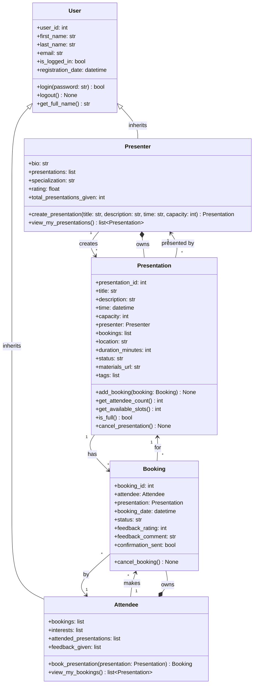
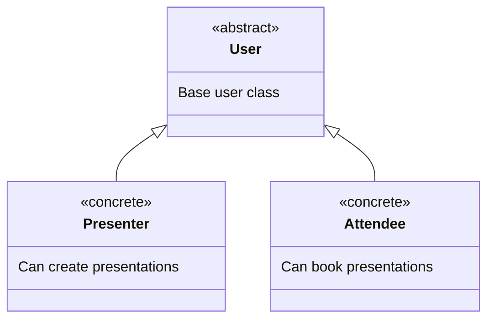
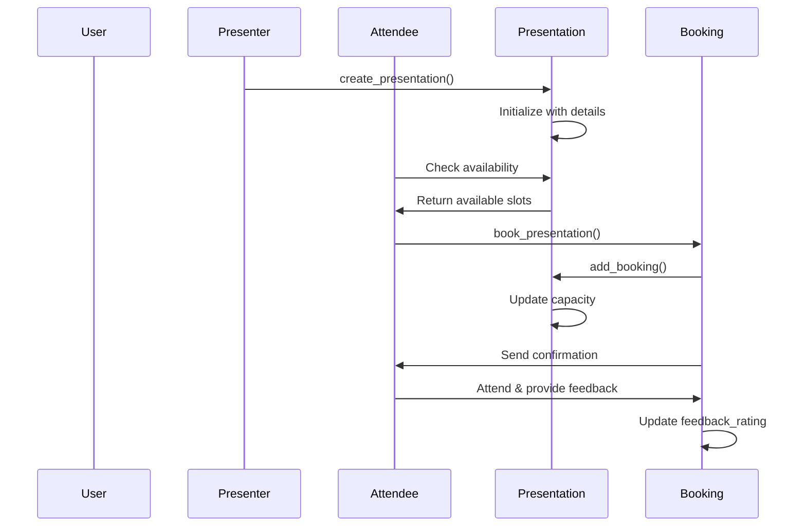

# BookMeIn2 Core System UML Class Diagram

## ASCII Art Class Diagram

```
+--------------------------------+
|              User              |  <|-- (Inheritance)
+--------------------------------+
| + user_id: int                 |
| + first_name: str              |
| + last_name: str               |
| + email: str                   |
| + is_logged_in: bool           |
| + registration_date: datetime  |
+--------------------------------+
| + login(password): bool        |
| + logout(): None               |
| + get_full_name(): str         |
+--------------------------------+
              ↑
              |
    +---------+---------+
    |                   |
    |                   |
+--------------------------------+              +--------------------------------+
|           Presenter            |              |            Attendee            |
+--------------------------------+              +--------------------------------+
| + bio: str                     |              | + bookings: list               |
| + presentations: list          |              | + interests: list              |
| + specialization: str          |              | + attended_presentations: list |
| + rating: float                |              | + feedback_given: list         |
| + total_presentations_given: int|              +--------------------------------+
+--------------------------------+              | + book_presentation(pres): Booking|
| + create_presentation(): Presentation|        | + view_my_bookings(): list     |
| + view_my_presentations(): list|              +--------------------------------+
+--------------------------------+                            |
         |                                                    | makes
         | creates                                            ↓
         ↓                                      +--------------------------------+
+--------------------------------+              |            Booking             |
|         Presentation           |              +--------------------------------+
+--------------------------------+              | + booking_id: int              |
| + presentation_id: int         |              | + attendee: Attendee           |
| + title: str                   |              | + presentation: Presentation   |
| + description: str             |              | + booking_date: datetime       |
| + time: datetime               |              | + status: str                  |
| + capacity: int                |              | + feedback_rating: int         |
| + presenter: Presenter         |              | + feedback_comment: str        |
| + bookings: list               |              | + confirmation_sent: bool      |
| + location: str                |              +--------------------------------+
| + duration_minutes: int        |              | + cancel_booking(): None       |
| + status: str                  |              +--------------------------------+
| + materials_url: str           |                            ↑
| + tags: list                   |                            | for
+--------------------------------+                            |
| + add_booking(booking): None   |                            |
| + get_attendee_count(): int    |-----------------------------
| + get_available_slots(): int   |              has
| + is_full(): bool              |
| + cancel_presentation(): None  |
+--------------------------------+

Relationships:
==============
• User <|-- Presenter (Inheritance)
• User <|-- Attendee (Inheritance)
• Presenter "1" --> "*" Presentation (creates/owns)
• Attendee "1" --> "*" Booking (makes)
• Booking "*" --> "1" Presentation (for)
• Booking "*" --> "1" Attendee (by)
• Presentation "*" --> "1" Presenter (presented by)
• Presentation "1" --> "*" Booking (has)

Composition:
============
• Presenter *-- Presentation (owns - presentations deleted if presenter deleted)
• Attendee *-- Booking (owns - bookings deleted if attendee deleted)
```

## Mermaid Class Diagram



## Class Hierarchy and Relationships

### Inheritance Structure


### Core Business Logic Flow


## Class Descriptions

### User (Base Class)
The abstract base class for all system users:
- **Attributes**: Core user information (ID, name, email, login status)
- **Methods**: Authentication and profile management
- **Purpose**: Provides common functionality for all user types

### Presenter (Derived from User)
Specialized user who can create and manage presentations:
- **Additional Attributes**: Biography, specialization, rating, presentation history
- **Key Methods**: Create presentations, view own presentations
- **Relationships**: Owns multiple presentations

### Attendee (Derived from User)
Specialized user who can book and attend presentations:
- **Additional Attributes**: Bookings, interests, attendance history, feedback
- **Key Methods**: Book presentations, view bookings
- **Relationships**: Creates bookings for presentations

### Presentation
Core entity representing an event/presentation:
- **Attributes**: Event details, capacity, location, materials, status
- **Methods**: Booking management, capacity checking, cancellation
- **Relationships**: Created by one Presenter, has many Bookings

### Booking
Association class linking Attendees to Presentations:
- **Attributes**: Booking details, status, feedback
- **Methods**: Cancel booking, update status
- **Purpose**: Manages the many-to-many relationship between Attendees and Presentations

## Design Patterns Used

### 1. **Inheritance Pattern**
- User serves as base class
- Presenter and Attendee inherit common functionality
- Promotes code reuse and maintainability

### 2. **Association Pattern**
- Booking acts as association class
- Manages many-to-many relationship
- Stores relationship-specific data (feedback, status)

### 3. **Factory Pattern (Implicit)**
- Presenter creates Presentation objects
- Attendee creates Booking objects

## System Constraints

### Business Rules
1. **Capacity Management**: Presentations cannot exceed maximum capacity
2. **Booking Status**: Tracks confirmed/cancelled/attended/no-show states
3. **Feedback System**: Collected after attendance
4. **Cancellation Policy**: Both presentations and bookings can be cancelled

### Data Integrity
1. **User Uniqueness**: Email addresses must be unique
2. **Booking Constraints**: One attendee can only book a presentation once
3. **Time Conflicts**: System should prevent double-booking (implementation detail)
4. **Rating System**: Ratings aggregated from feedback

## Future Enhancements
- Payment processing for paid presentations
- Waitlist management for full presentations
- Recurring presentation series
- Virtual presentation support
- Advanced search and recommendation engine
- Mobile app integration