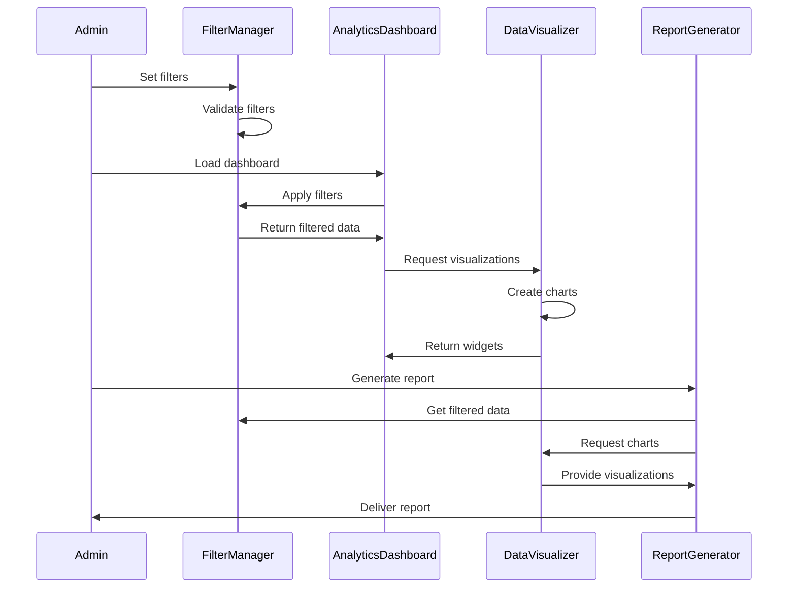

# FeedbackReportingHub UML Class Diagram

## ASCII Art Class Diagram

```
+--------------------------------+              +--------------------------------+
|      AnalyticsDashboard        |              |        ReportGenerator         |
+--------------------------------+              +--------------------------------+
| + event_id: str                |              | + selected_report_type: str   |
| + overall_event_rating: float  |              | + report_templates: list       |
| + total_feedback_submissions: int|            | + generated_report: dict       |
| + delegate_engagement_score: float|           | + report_format: str           |
| + most_successful_talk: str    |              | + include_visualizations: bool |
| + keynote_address_score: float |              +--------------------------------+
| + attendance_metrics: dict     |              | + select_report_type(): None   |
| + engagement_trends: list      |              | + generate_conference_report() |
| + real_time_data: dict         |              | + generate_presentation_report()|
+--------------------------------+              | + generate_speaker_feedback()  |
| + load_dashboard_data(): dict  |              | + generate_engagement_report() |
| + calculate_overall_rating(): float|          | + generate_financial_report()  |
| + get_feedback_count(): int    |              | + generate_technical_report()  |
| + calculate_engagement_score() |              | + customize_report(): None     |
| + identify_top_sessions(): list|              | + add_custom_section(): None   |
| + get_attendance_metrics(): dict|             | + preview_report(): dict       |
| + get_engagement_trends(): list|              | + download_report(): bytes     |
| + get_real_time_metrics(): dict|              | + schedule_report(): bool      |
| + compare_to_previous_event()  |              | + batch_generate(): list       |
| + get_demographic_breakdown()  |              | + email_report(): bool         |
| + get_session_performance(): list|            +--------------------------------+
| + export_dashboard(): bytes    |                            |
| + set_refresh_interval(): None |                            | includes visualizations
+--------------------------------+                            ↓
         |                                      +--------------------------------+
         | uses for charts                      |        DataVisualizer          |
         ↓                                      +--------------------------------+
    DataVisualizer                              | + chart_type: str              |
         |                                      | + data_source: dict            |
         | applies filters                      | + color_scheme: str            |
         ↓                                      | + chart_title: str             |
+--------------------------------+              | + axis_labels: dict            |
|         FilterManager          |              | + visualization_cache: dict    |
+--------------------------------+              +--------------------------------+
| + active_filters: dict         |              | + create_bar_chart(): bytes    |
| + date_range: dict             |              | + create_line_chart(): bytes   |
| + event_filter: str            |              | + create_pie_chart(): bytes    |
| + session_filter: str          |              | + create_word_cloud(): bytes   |
| + speaker_filter: str          |              | + create_heat_map(): bytes     |
| + track_filter: str            |              | + create_scatter_plot(): bytes |
| + saved_filters: list          |              | + create_timeline(): bytes     |
| + filter_presets: list         |              | + create_dashboard_widget(): dict|
+--------------------------------+              | + set_color_scheme(): None     |
| + set_date_filter(): None      |              | + add_annotations(): bool      |
| + set_event_filter(): None     |              | + export_visualization(): bytes|
| + set_session_filter(): None   |              | + create_comparison_chart(): bytes|
| + set_speaker_filter(): None   |              | + animate_chart(): dict        |
| + set_track_filter(): None     |              | + create_infographic(): bytes  |
| + add_custom_filter(): None    |              +--------------------------------+
| + remove_filter(): bool        |                            ↑
| + clear_all_filters(): None    |                            | provides charts to
| + save_filter_set(): bool      |                            |
| + load_filter_set(): bool      |              ReportGenerator
| + get_filter_presets(): list   |                            |
| + apply_preset(): bool         |                            | uses filtered data
| + validate_filters(): list     |                            ↓
| + get_filtered_data_count(): int|             FilterManager
| + export_filter_config(): dict |
| + import_filter_config(): bool |
+--------------------------------+

Data Flow:
==========
FilterManager → AnalyticsDashboard → DataVisualizer → ReportGenerator
    ↑                                                        |
    |________________________________________________________|
                    (filters data for reports)
```

## Mermaid Class Diagram

```mermaid
classDiagram
    class AnalyticsDashboard {
        +event_id: str
        +overall_event_rating: float
        +total_feedback_submissions: int
        +delegate_engagement_score: float
        +most_successful_talk: str
        +keynote_address_score: float
        +attendance_metrics: dict
        +engagement_trends: list
        +real_time_data: dict
        +load_dashboard_data(event_id: str) dict
        +calculate_overall_rating() float
        +get_feedback_count() int
        +calculate_engagement_score() float
        +identify_top_sessions(limit: int) list
        +get_attendance_metrics() dict
        +get_engagement_trends(period: str) list
        +get_real_time_metrics() dict
        +compare_to_previous_event(previous_event_id: str) dict
        +get_demographic_breakdown() dict
        +get_session_performance() list
        +export_dashboard(format: str) bytes
        +set_refresh_interval(seconds: int) None
    }

    class ReportGenerator {
        +selected_report_type: str
        +report_templates: list
        +generated_report: dict
        +report_format: str
        +include_visualizations: bool
        +select_report_type(report_type: str) None
        +generate_conference_report() dict
        +generate_presentation_report(presentation_id: str) dict
        +generate_speaker_feedback_report() dict
        +generate_engagement_report() dict
        +generate_financial_report() dict
        +generate_technical_report() dict
        +customize_report(options: dict) None
        +add_custom_section(title: str, content: str) None
        +preview_report() dict
        +download_report(format: str) bytes
        +schedule_report(report_type: str, schedule: datetime) bool
        +batch_generate(report_types: list) list
        +email_report(recipients: list) bool
    }

    class DataVisualizer {
        +chart_type: str
        +data_source: dict
        +color_scheme: str
        +chart_title: str
        +axis_labels: dict
        +visualization_cache: dict
        +create_bar_chart(data: dict, options: dict) bytes
        +create_line_chart(data: dict, options: dict) bytes
        +create_pie_chart(data: dict, options: dict) bytes
        +create_word_cloud(text_data: list, options: dict) bytes
        +create_heat_map(data: dict, options: dict) bytes
        +create_scatter_plot(data: dict, options: dict) bytes
        +create_timeline(events: list) bytes
        +create_dashboard_widget(widget_type: str, data: dict) dict
        +set_color_scheme(scheme: str) None
        +add_annotations(chart_id: str, annotations: list) bool
        +export_visualization(viz_id: str, format: str) bytes
        +create_comparison_chart(datasets: list) bytes
        +animate_chart(chart_id: str, duration: int) dict
        +create_infographic(data: dict, template: str) bytes
    }

    class FilterManager {
        +active_filters: dict
        +date_range: dict
        +event_filter: str
        +session_filter: str
        +speaker_filter: str
        +track_filter: str
        +saved_filters: list
        +filter_presets: list
        +set_date_filter(start_date: date, end_date: date) None
        +set_event_filter(event_id: str) None
        +set_session_filter(session_ids: list) None
        +set_speaker_filter(speaker_ids: list) None
        +set_track_filter(track: str) None
        +add_custom_filter(field: str, operator: str, value: any) None
        +remove_filter(filter_name: str) bool
        +clear_all_filters() None
        +save_filter_set(name: str) bool
        +load_filter_set(name: str) bool
        +get_filter_presets() list
        +apply_preset(preset_name: str) bool
        +validate_filters() list
        +get_filtered_data_count() int
        +export_filter_config() dict
        +import_filter_config(config: dict) bool
    }

    %% Core relationships
    AnalyticsDashboard --> DataVisualizer : uses for charts
    AnalyticsDashboard --> FilterManager : applies filters
    ReportGenerator --> DataVisualizer : includes visualizations
    ReportGenerator --> FilterManager : uses filtered data
    FilterManager --> AnalyticsDashboard : filters data for
    DataVisualizer --> ReportGenerator : provides charts to
    
    %% Composition relationships
    AnalyticsDashboard *-- DataVisualizer : contains
    ReportGenerator *-- FilterManager : uses
```



## Class Descriptions

### AnalyticsDashboard
Main analytics hub displaying KPIs and metrics:
- Overall event ratings and feedback counts
- Engagement scores and trends
- Attendance metrics and demographics
- Real-time data updates
- Session performance tracking
- Event comparison tools

### ReportGenerator
Comprehensive report creation system:
- Multiple report templates (conference, presentation, speaker)
- Customizable report sections
- Various export formats (PDF, CSV, Excel)
- Scheduled report generation
- Batch processing capabilities
- Email distribution

### DataVisualizer
Advanced visualization creation:
- Multiple chart types (bar, line, pie, scatter)
- Word clouds from feedback text
- Heat maps for engagement
- Interactive dashboard widgets
- Custom color schemes
- Animation capabilities
- Infographic generation

### FilterManager
Data filtering and organization:
- Date range filtering
- Multi-criteria filtering (event, session, speaker, track)
- Custom filter creation
- Filter presets and templates
- Filter configuration import/export
- Validation and data count

## Analytics Workflow



## Key Features

### Dashboard Features
- **Real-time updates** with configurable refresh
- **KPI tracking** with trend analysis
- **Comparative analytics** across events
- **Demographic insights** from attendee data
- **Performance metrics** for all sessions

### Visualization Capabilities
- **Interactive charts** with hover details
- **Word clouds** from feedback text
- **Heat maps** for engagement patterns
- **Animated transitions** for presentations
- **Custom branding** with color schemes

### Reporting Tools
- **Template library** for common reports
- **Custom sections** for specific needs
- **Multi-format export** (PDF, CSV, Excel)
- **Scheduled generation** for regular reports
- **Batch processing** for efficiency

### Data Management
- **Advanced filtering** with multiple criteria
- **Filter presets** for common views
- **Save/load** filter configurations
- **Data validation** for accuracy
- **Export/import** configurations

## Visual Examples

### Chart Types Available
1. **Bar Charts** - Session attendance, ratings
2. **Line Charts** - Engagement trends over time
3. **Pie Charts** - Demographic breakdowns
4. **Word Clouds** - Feedback sentiment analysis
5. **Heat Maps** - Time-based engagement
6. **Scatter Plots** - Correlation analysis
7. **Timeline Views** - Event progression
8. **Infographics** - Executive summaries