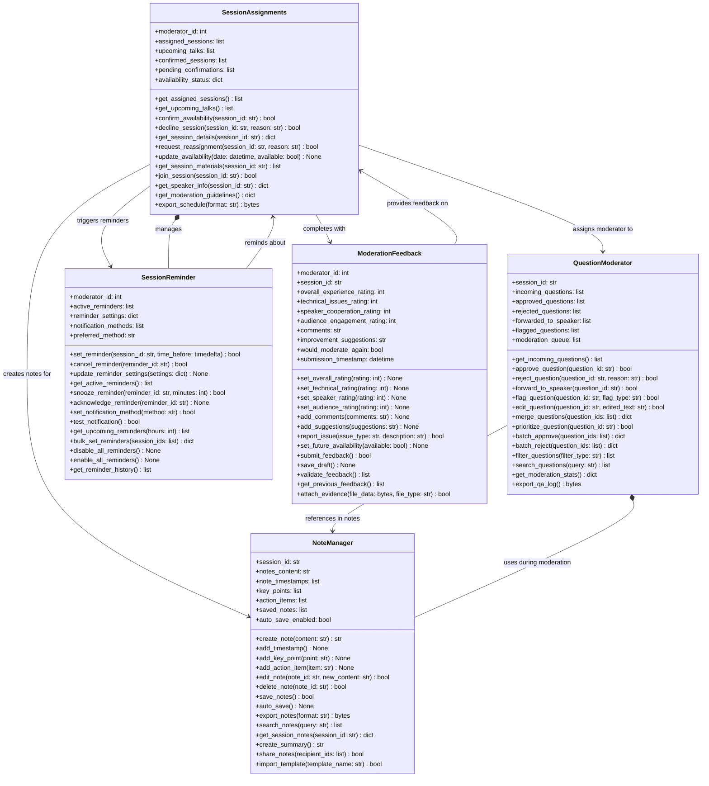
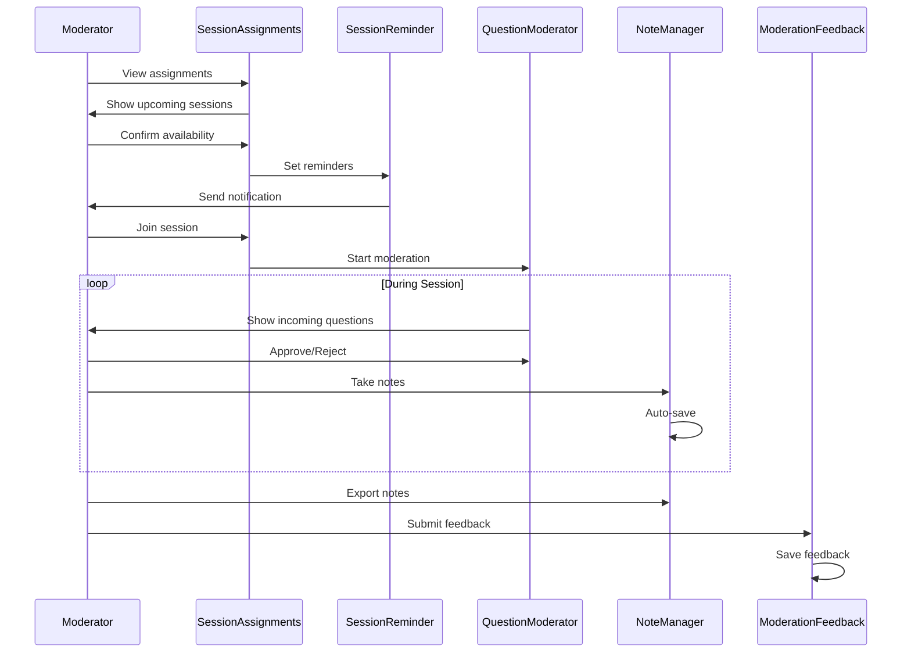

# ModeratorDesk UML Class Diagram

## ASCII Art Class Diagram

```
+--------------------------------+              +--------------------------------+
|      SessionAssignments        |              |       QuestionModerator        |
+--------------------------------+              +--------------------------------+
| + moderator_id: int            |              | + session_id: str              |
| + assigned_sessions: list      |              | + incoming_questions: list     |
| + upcoming_talks: list         |              | + approved_questions: list     |
| + confirmed_sessions: list     |              | + rejected_questions: list     |
| + pending_confirmations: list  |              | + forwarded_to_speaker: list   |
| + availability_status: dict    |              | + flagged_questions: list      |
+--------------------------------+              | + moderation_queue: list       |
| + get_assigned_sessions(): list|              +--------------------------------+
| + get_upcoming_talks(): list   |              | + get_incoming_questions(): list|
| + confirm_availability(): bool |              | + approve_question(): bool     |
| + decline_session(): bool      |              | + reject_question(): bool      |
| + get_session_details(): dict  |              | + forward_to_speaker(): bool   |
| + request_reassignment(): bool |              | + flag_question(): bool        |
| + update_availability(): None  |              | + edit_question(): bool        |
| + get_session_materials(): list|              | + merge_questions(): dict      |
| + join_session(): bool         |              | + prioritize_question(): bool  |
| + get_speaker_info(): dict     |              | + batch_approve(): dict        |
| + get_moderation_guidelines()  |              | + batch_reject(): dict         |
| + export_schedule(): bytes     |              | + filter_questions(): list     |
+--------------------------------+              | + search_questions(): list     |
         |                                      | + get_moderation_stats(): dict |
         | assigns moderator to                 | + export_qa_log(): bytes       |
         ↓                                      +--------------------------------+
    QuestionModerator                                        |
         |                                                   | references in notes
         | creates notes for                                ↓
         ↓                                      +--------------------------------+
+--------------------------------+              |          NoteManager           |
|       SessionReminder          |              +--------------------------------+
+--------------------------------+              | + session_id: str              |
| + moderator_id: int            |              | + notes_content: str           |
| + active_reminders: list       |              | + note_timestamps: list        |
| + reminder_settings: dict      |              | + key_points: list             |
| + notification_methods: list   |              | + action_items: list           |
| + preferred_method: str        |              | + saved_notes: list            |
+--------------------------------+              | + auto_save_enabled: bool      |
| + set_reminder(): bool         |              +--------------------------------+
| + cancel_reminder(): bool      |              | + create_note(): str           |
| + update_reminder_settings()   |              | + add_timestamp(): None        |
| + get_active_reminders(): list |              | + add_key_point(): None        |
| + snooze_reminder(): bool      |              | + add_action_item(): None      |
| + acknowledge_reminder(): None |              | + edit_note(): bool            |
| + set_notification_method(): bool|            | + delete_note(): bool          |
| + test_notification(): bool    |              | + save_notes(): bool           |
| + get_upcoming_reminders(): list|             | + auto_save(): None            |
| + bulk_set_reminders(): dict   |              | + export_notes(): bytes        |
| + disable_all_reminders(): None|              | + search_notes(): list         |
| + enable_all_reminders(): None |              | + get_session_notes(): dict    |
| + get_reminder_history(): list |              | + create_summary(): str        |
+--------------------------------+              | + share_notes(): bool          |
         ↑                                      | + import_template(): bool      |
         | reminds about                        +--------------------------------+
         |                                      
    SessionAssignments                          
         |                                      
         | completes with                       
         ↓                                      
+--------------------------------+
|      ModerationFeedback        |
+--------------------------------+
| + moderator_id: int            |
| + session_id: str              |
| + overall_experience_rating: int|
| + technical_issues_rating: int |
| + speaker_cooperation_rating: int|
| + audience_engagement_rating: int|
| + comments: str                |
| + improvement_suggestions: str |
| + would_moderate_again: bool   |
| + submission_timestamp: datetime|
+--------------------------------+
| + set_overall_rating(): None   |
| + set_technical_rating(): None |
| + set_speaker_rating(): None   |
| + set_audience_rating(): None  |
| + add_comments(): None         |
| + add_suggestions(): None      |
| + report_issue(): bool         |
| + set_future_availability()    |
| + submit_feedback(): bool      |
| + save_draft(): None           |
| + validate_feedback(): list    |
| + get_previous_feedback(): list|
| + attach_evidence(): bool      |
+--------------------------------+

Moderator Workflow:
===================
SessionAssignments → SessionReminder → Join Session → QuestionModerator + NoteManager → ModerationFeedback
```

## Mermaid Class Diagram



## Class Descriptions

### SessionAssignments
Manages moderator's session assignments:
- View assigned and upcoming sessions
- Confirm or decline assignments
- Update availability calendar
- Access session materials and speaker info
- Export moderation schedule

### QuestionModerator
Real-time question moderation during sessions:
- Review incoming audience questions
- Approve/reject/edit questions
- Forward questions to speakers
- Flag inappropriate content
- Batch operations for efficiency
- Export Q&A logs

### NoteManager
Private note-taking during moderation:
- Create timestamped notes
- Mark key points and action items
- Auto-save functionality
- Template support
- Note sharing capabilities
- Export in multiple formats

### SessionReminder
Reminder management for moderation duties:
- Set custom reminders
- Multiple notification methods (email, push, SMS)
- Snooze functionality
- Bulk reminder settings
- Test notifications

### ModerationFeedback
Post-session feedback collection:
- Rate multiple aspects (technical, speaker, audience)
- Provide detailed comments
- Report issues with evidence
- Future availability indication

## Moderator Workflow



## Key Features

### Pre-Session
- **Assignment management** with accept/decline
- **Availability calendar** for scheduling
- **Session preparation** with materials access
- **Customizable reminders** with multiple channels

### During Session
- **Real-time Q&A moderation** with filtering
- **Question editing** for clarity
- **Batch operations** for efficiency
- **Note-taking** with timestamps
- **Auto-save** functionality

### Post-Session
- **Multi-dimensional feedback** system
- **Issue reporting** with evidence
- **Note export** in multiple formats
- **Q&A log generation**

### Productivity Features
- **Template support** for notes
- **Search functionality** across questions and notes
- **Bulk operations** for efficiency
- **Calendar export** for schedule management
- **Statistics tracking** for moderation activity