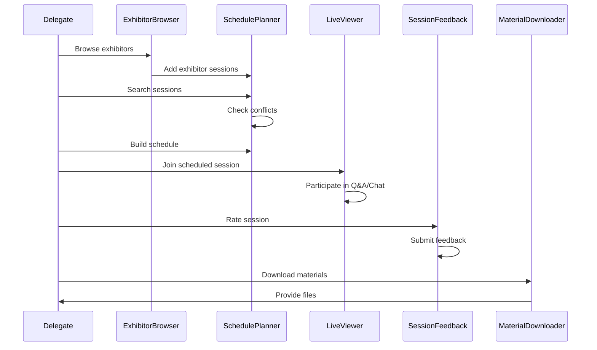

# MyEventPortal UML Class Diagram

## ASCII Art Class Diagram

```
+--------------------------------+              +--------------------------------+
|       ExhibitorBrowser         |              |       MaterialDownloader       |
+--------------------------------+              +--------------------------------+
| + exhibitor_list: list         |              | + session_title: str           |
| + selected_exhibitor: dict     |              | + session_id: str              |
| + exhibitor_logo: bytes        |              | + recording_url: str           |
| + exhibitor_name: str          |              | + available_downloads: list    |
| + about_text: str              |              | + download_history: list       |
| + sessions_list: list          |              | + download_formats: list       |
| + contact_email: str           |              +--------------------------------+
| + website_url: str             |              | + load_session_materials(): list|
| + social_links: dict           |              | + download_presentation(): bytes|
| + booth_location: str          |              | + download_recording(): str    |
+--------------------------------+              | + download_qa_log(): bytes     |
| + load_exhibitors(): list      |              | + download_attendee_list(): bytes|
| + view_exhibitor_details(): dict|             | + download_session_notes(): bytes|
| + get_exhibitor_sessions(): list|             | + batch_download(): list       |
| + get_contact_information(): dict|            | + get_download_history(): list |
| + bookmark_exhibitor(): bool   |              | + check_permissions(): bool    |
| + search_exhibitors(): list    |              | + stream_recording(): str      |
| + filter_by_category(): list   |              | + save_to_cloud(): bool        |
| + get_booth_location(): str    |              +--------------------------------+
| + schedule_meeting(): bool     |                            ↑
| + export_exhibitor_info(): str |                            |
+--------------------------------+                            | provides recordings
         |                                                    |
         | adds meetings to                                   |
         ↓                                                    |
+--------------------------------+              +--------------------------------+
|        SchedulePlanner         |              |           LiveViewer           |
+--------------------------------+              +--------------------------------+
| + user_schedule: list          |              | + session_id: str              |
| + search_query: str            |              | + stream_url: str              |
| + selected_track: str          |              | + is_streaming: bool           |
| + selected_time_filter: str    |              | + viewer_count: int            |
| + available_sessions: list     |              | + qa_messages: list            |
| + exhibitor_visits: list       |              | + chat_messages: list          |
| + time_slots: list             |              | + active_tab: str              |
| + conflicts: list              |              | + question_text: str           |
| + reminders_enabled: bool      |              | + is_muted: bool               |
+--------------------------------+              | + video_quality: str           |
| + search_sessions(): list      |              | + captions_enabled: bool       |
| + filter_by_track(): list      |              +--------------------------------+
| + filter_by_time(): list       |              | + join_live_session(): bool    |
| + add_to_schedule(): bool      |              | + leave_session(): None        |
| + remove_from_schedule(): bool |              | + submit_question(): bool      |
| + check_conflicts(): list      |              | + send_chat_message(): bool    |
| + resolve_conflict(): bool     |              | + switch_tab(): None           |
| + view_daily_schedule(): list  |              | + upvote_question(): bool      |
| + export_schedule(): bytes     |              | + toggle_mute(): bool          |
| + set_reminder(): bool         |              | + set_video_quality(): None    |
| + get_recommendations(): list  |              | + toggle_captions(): bool      |
| + sync_with_calendar(): bool   |              | + take_screenshot(): bytes     |
+--------------------------------+              | + report_issue(): bool         |
         |                                      | + get_stream_stats(): dict     |
         | schedules sessions for               | + enter_fullscreen(): None     |
         |                                      | + exit_fullscreen(): None      |
         ↓                                      +--------------------------------+
         LiveViewer                                           |
                                                              | triggers after session
                                                              ↓
+--------------------------------+
|        SessionFeedback         |
+--------------------------------+
| + session_id: str              |
| + session_title: str           |
| + rating: int                  |
| + comments: str                |
| + is_anonymous: bool           |
| + feedback_timestamp: datetime |
| + speaker_rating: int          |
| + content_rating: int          |
| + venue_rating: int            |
| + would_recommend: bool        |
+--------------------------------+
| + set_overall_rating(): None   |
| + set_speaker_rating(): None   |
| + set_content_rating(): None   |
| + set_venue_rating(): None     |
| + add_comments(): None         |
| + set_recommendation(): None   |
| + submit_feedback(): bool      |
| + cancel_feedback(): None      |
| + save_draft(): None           |
| + validate_feedback(): list    |
| + get_previous_feedback(): list|
| + edit_feedback(): bool        |
+--------------------------------+

User Journey Flow:
==================
ExhibitorBrowser → SchedulePlanner → LiveViewer → SessionFeedback → MaterialDownloader
    (Browse)         (Plan)           (Attend)      (Feedback)        (Download)
```

## Mermaid Class Diagram

```mermaid
classDiagram
    class ExhibitorBrowser {
        +exhibitor_list: list
        +selected_exhibitor: dict
        +exhibitor_logo: bytes
        +exhibitor_name: str
        +about_text: str
        +sessions_list: list
        +contact_email: str
        +website_url: str
        +social_links: dict
        +booth_location: str
        +load_exhibitors() list
        +view_exhibitor_details(exhibitor_id: str) dict
        +get_exhibitor_sessions(exhibitor_id: str) list
        +get_contact_information(exhibitor_id: str) dict
        +bookmark_exhibitor(exhibitor_id: str) bool
        +search_exhibitors(query: str) list
        +filter_by_category(category: str) list
        +get_booth_location(exhibitor_id: str) str
        +schedule_meeting(exhibitor_id: str, time_slot: str) bool
        +export_exhibitor_info(exhibitor_id: str) str
    }

    class MaterialDownloader {
        +session_title: str
        +session_id: str
        +recording_url: str
        +available_downloads: list
        +download_history: list
        +download_formats: list
        +load_session_materials(session_id: str) list
        +download_presentation(session_id: str, format: str) bytes
        +download_recording(session_id: str) str
        +download_qa_log(session_id: str, format: str) bytes
        +download_attendee_list(session_id: str) bytes
        +download_session_notes(session_id: str) bytes
        +batch_download(file_ids: list) list
        +get_download_history() list
        +check_download_permissions(file_id: str) bool
        +stream_recording(session_id: str) str
        +save_to_cloud(file_id: str, cloud_service: str) bool
    }

    class SchedulePlanner {
        +user_schedule: list
        +search_query: str
        +selected_track: str
        +selected_time_filter: str
        +available_sessions: list
        +exhibitor_visits: list
        +time_slots: list
        +conflicts: list
        +reminders_enabled: bool
        +search_sessions(query: str) list
        +filter_by_track(track: str) list
        +filter_by_time(time_slot: str) list
        +add_to_schedule(session_id: str) bool
        +remove_from_schedule(session_id: str) bool
        +check_conflicts() list
        +resolve_conflict(conflict_id: str, choice: str) bool
        +view_daily_schedule(date: datetime) list
        +export_schedule(format: str) bytes
        +set_reminder(session_id: str, minutes_before: int) bool
        +get_recommendations() list
        +sync_with_calendar(calendar_service: str) bool
    }

    class SessionFeedback {
        +session_id: str
        +session_title: str
        +rating: int
        +comments: str
        +is_anonymous: bool
        +feedback_timestamp: datetime
        +speaker_rating: int
        +content_rating: int
        +venue_rating: int
        +would_recommend: bool
        +set_overall_rating(rating: int) None
        +set_speaker_rating(rating: int) None
        +set_content_rating(rating: int) None
        +set_venue_rating(rating: int) None
        +add_comments(comments: str) None
        +set_recommendation(would_recommend: bool) None
        +submit_feedback() bool
        +cancel_feedback() None
        +save_draft() None
        +validate_feedback() list
        +get_previous_feedback() list
        +edit_feedback(feedback_id: str) bool
    }

    class LiveViewer {
        +session_id: str
        +stream_url: str
        +is_streaming: bool
        +viewer_count: int
        +qa_messages: list
        +chat_messages: list
        +active_tab: str
        +question_text: str
        +is_muted: bool
        +video_quality: str
        +captions_enabled: bool
        +join_live_session(session_id: str) bool
        +leave_session() None
        +submit_question(question: str) bool
        +send_chat_message(message: str) bool
        +switch_tab(tab: str) None
        +upvote_question(question_id: str) bool
        +toggle_mute() bool
        +set_video_quality(quality: str) None
        +toggle_captions() bool
        +take_screenshot() bytes
        +report_issue(issue_type: str, description: str) bool
        +get_stream_stats() dict
        +enter_fullscreen() None
        +exit_fullscreen() None
    }

    %% Relationships
    SchedulePlanner --> LiveViewer : schedules sessions for
    SchedulePlanner --> ExhibitorBrowser : includes exhibitor visits
    LiveViewer --> SessionFeedback : triggers after session
    MaterialDownloader --> LiveViewer : provides recordings from
    ExhibitorBrowser --> SchedulePlanner : adds meetings to
    SessionFeedback --> MaterialDownloader : links to session materials
    
    %% User Journey Flow
    ExhibitorBrowser --|> SchedulePlanner : "Browse -> Plan"
    SchedulePlanner --|> LiveViewer : "Plan -> Attend"
    LiveViewer --|> SessionFeedback : "Attend -> Feedback"
    LiveViewer --|> MaterialDownloader : "Attend -> Download"
```



## Class Descriptions

### ExhibitorBrowser
Allows delegates to browse and interact with exhibitor information:
- View exhibitor profiles and booth locations
- Browse exhibitor sessions
- Schedule meetings with exhibitors
- Export contact information

### MaterialDownloader
Manages downloading of session materials and recordings:
- Download presentations in various formats
- Access session recordings
- Download Q&A logs and attendee lists
- Cloud storage integration

### SchedulePlanner
Personal schedule management for delegates:
- Search and filter sessions
- Build personal agenda
- Conflict detection and resolution
- Calendar synchronization
- Reminder settings

### SessionFeedback
Collect feedback after attending sessions:
- Multi-aspect rating system (overall, speaker, content, venue)
- Text comments
- Anonymous submission option
- Recommendation tracking

### LiveViewer
Live session viewing and interaction:
- Video streaming controls
- Q&A participation
- Live chat
- Quality settings
- Screenshot capability

## Delegate User Journey



## Key Features

### Interactive Features
- **Live streaming** with quality controls
- **Real-time Q&A** and chat
- **Upvoting** for questions
- **Screenshot** functionality

### Planning Tools
- **Conflict detection** in scheduling
- **Smart recommendations** based on interests
- **Calendar integration** (Google, Outlook)
- **Customizable reminders**

### Content Access
- **Multiple download formats** (PDF, DOCX, CSV)
- **Cloud storage integration**
- **Streaming options** for recordings
- **Permission-based access**

### Engagement
- **Multi-dimensional feedback** (speaker, content, venue)
- **Anonymous feedback option**
- **Exhibitor bookmarking**
- **Meeting scheduling** with exhibitors