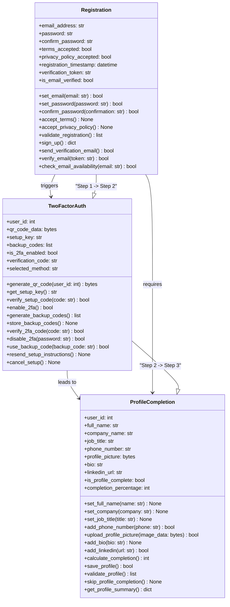
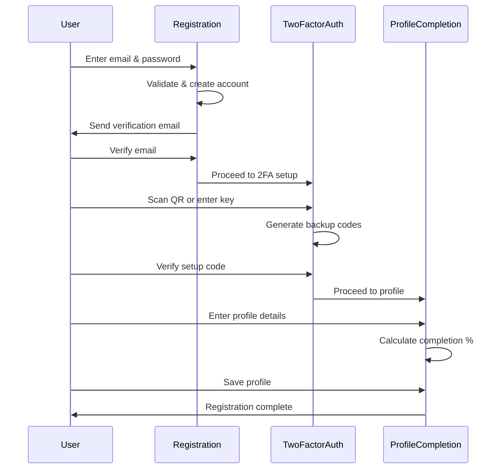

# SignUp Module UML Class Diagram

## ASCII Art Class Diagram

```
+--------------------------------+
|         Registration           |
+--------------------------------+
| + email_address: str           |
| + password: str                |
| + confirm_password: str        |
| + terms_accepted: bool         |
| + privacy_policy_accepted: bool|
| + registration_timestamp: datetime|
| + verification_token: str      |
| + is_email_verified: bool      |
+--------------------------------+
| + set_email(email): bool       |
| + set_password(password): bool |
| + confirm_password(conf): bool |
| + accept_terms(): None         |
| + accept_privacy_policy(): None|
| + validate_registration(): list|
| + sign_up(): dict              |
| + send_verification_email(): bool|
| + verify_email(token): bool    |
| + check_email_availability(): bool|
+--------------------------------+
                |
                | triggers
                ↓
+--------------------------------+
|        TwoFactorAuth           |
+--------------------------------+
| + user_id: int                 |
| + qr_code_data: bytes          |
| + setup_key: str               |
| + backup_codes: list           |
| + is_2fa_enabled: bool         |
| + verification_code: str       |
| + selected_method: str         |
+--------------------------------+
| + generate_qr_code(id): bytes  |
| + get_setup_key(): str         |
| + verify_setup_code(code): bool|
| + enable_2fa(): bool           |
| + generate_backup_codes(): list|
| + store_backup_codes(): None   |
| + verify_2fa_code(code): bool  |
| + disable_2fa(password): bool  |
| + use_backup_code(code): bool  |
| + resend_setup_instructions()  |
| + cancel_setup(): None         |
+--------------------------------+
                |
                | leads to
                ↓
+--------------------------------+
|       ProfileCompletion        |
+--------------------------------+
| + user_id: int                 |
| + full_name: str               |
| + company_name: str            |
| + job_title: str               |
| + phone_number: str            |
| + profile_picture: bytes       |
| + bio: str                     |
| + linkedin_url: str            |
| + is_profile_complete: bool    |
| + completion_percentage: int   |
+--------------------------------+
| + set_full_name(name): None    |
| + set_company(company): None   |
| + set_job_title(title): None   |
| + add_phone_number(phone): bool|
| + upload_profile_picture(): bool|
| + add_bio(bio): None           |
| + add_linkedin(url): bool      |
| + calculate_completion(): int  |
| + save_profile(): bool         |
| + validate_profile(): list     |
| + skip_profile_completion()    |
| + get_profile_summary(): dict  |
+--------------------------------+

Sequential Flow:
================
    Registration (Step 1)
           ↓
    TwoFactorAuth (Step 2)
           ↓
    ProfileCompletion (Step 3)
```

## Mermaid Class Diagram



## Class Descriptions

### Registration
Handles the initial user registration process including:
- Email and password collection
- Terms and privacy policy acceptance
- Email verification
- Account creation

### TwoFactorAuth
Manages two-factor authentication setup:
- QR code generation for authenticator apps
- Manual setup key provision
- Backup code generation
- 2FA verification and management

### ProfileCompletion
Handles user profile completion after registration:
- Personal information collection (name, company, job title)
- Profile picture upload
- Professional details
- Profile completion tracking

## Registration Flow



## Key Features

### Security Features
- **Password strength validation** in Registration class
- **Email verification** with secure tokens
- **Two-factor authentication** with QR codes and backup codes
- **GDPR compliance** through privacy policy acceptance

### User Experience
- **Progressive registration** - split into manageable steps
- **Profile completion tracking** - shows percentage complete
- **Skip option** for profile completion
- **Multiple 2FA methods** - QR code or manual key entry

## Data Validation
- Email format and availability checking
- Password strength requirements
- Phone number format validation
- LinkedIn URL validation
- Profile picture size and format validation