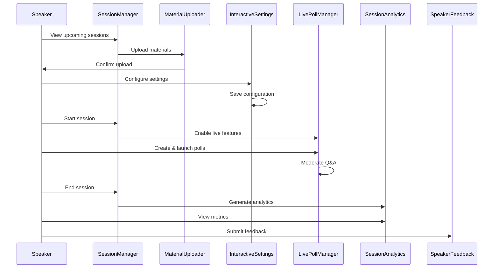

# SpeakerStudio UML Class Diagram

## ASCII Art Class Diagram

```
+--------------------------------+              +--------------------------------+
|        SessionManager          |              |       MaterialUploader         |
+--------------------------------+              +--------------------------------+
| + speaker_id: int              |              | + session_id: str              |
| + upcoming_sessions: list      |              | + session_title: str           |
| + past_sessions: list          |              | + uploaded_files: list         |
| + current_session: dict        |              | + pending_uploads: list        |
| + session_materials: dict      |              | + failed_uploads: list         |
| + session_settings: dict       |              | + upload_progress: dict        |
+--------------------------------+              | + supported_formats: list      |
| + get_upcoming_sessions(): list|              | + max_file_size: int           |
| + get_session_details(): dict  |              +--------------------------------+
| + upload_materials_for_session()|             | + select_files(): list         |
| + configure_session_settings() |              | + drag_drop_files(): list      |
| + start_session(): bool        |              | + validate_file(): bool        |
| + end_session(): bool          |              | + upload_file(): bool          |
| + get_session_status(): str    |              | + batch_upload(): dict         |
| + update_session_info(): bool  |              | + get_upload_progress(): int   |
| + cancel_session(): bool       |              | + cancel_upload(): bool        |
| + reschedule_session(): bool   |              | + retry_failed_upload(): bool  |
| + get_attendee_list(): list    |              | + remove_uploaded_file(): bool |
| + send_announcement(): bool    |              | + organize_materials(): bool   |
+--------------------------------+              | + set_file_permissions(): bool |
         |                                      | + preview_file(): bytes        |
         | initiates upload                     +--------------------------------+
         ↓                                                    
         MaterialUploader                       +--------------------------------+
         |                                      |      InteractiveSettings       |
         | configures                           +--------------------------------+
         ↓                                      | + session_id: str              |
+--------------------------------+              | + qa_enabled: bool             |
|       LivePollManager          |              | + polls_enabled: bool          |
+--------------------------------+              | + chat_enabled: bool           |
| + session_id: str              |              | + anonymous_questions: bool    |
| + active_poll: dict            |              | + moderation_enabled: bool     |
| + poll_queue: list             |              | + auto_record: bool            |
| + completed_polls: list        |              | + allow_downloads: bool        |
| + moderated_questions: list    |              | + settings_saved: bool         |
| + live_feed_active: bool       |              +--------------------------------+
| + screen_share_active: bool    |              | + enable_audience_qa(): None   |
+--------------------------------+              | + disable_audience_qa(): None  |
| + create_poll(): dict          |              | + enable_live_polls(): None    |
| + launch_poll(): bool          |              | + disable_live_polls(): None   |
| + close_poll(): dict           |              | + toggle_chat(): bool          |
| + get_poll_results(): dict     |              | + set_anonymous_questions()    |
| + display_results(): None      |              | + set_moderation(): None       |
| + queue_poll(): None           |              | + set_recording(): None        |
| + edit_poll(): bool            |              | + set_download_permissions()   |
| + delete_poll(): bool          |              | + save_settings(): bool        |
| + get_moderated_questions(): list|            | + load_settings(): dict        |
| + approve_question(): bool     |              | + apply_template(): bool       |
| + reject_question(): bool      |              | + create_template(): bool      |
| + start_screen_share(): bool   |              +--------------------------------+
| + stop_screen_share(): bool    |                            ↑
| + toggle_live_feed(): bool     |                            | checks settings
+--------------------------------+                            |
         |                                      LivePollManager
         | provides poll data                  
         ↓                                      
+--------------------------------+              +--------------------------------+
|       SessionAnalytics         |              |        SpeakerFeedback         |
+--------------------------------+              +--------------------------------+
| + session_id: str              |              | + speaker_id: int              |
| + peak_viewers: int            |              | + event_id: str                |
| + engagement_score: float      |              | + platform_rating: int         |
| + questions_asked: int         |              | + technical_support_rating: int|
| + poll_participation: float    |              | + organization_rating: int     |
| + average_view_duration: int   |              | + additional_comments: str     |
| + attendee_demographics: dict  |              | + improvement_suggestions: str |
| + interaction_timeline: list   |              | + would_speak_again: bool      |
+--------------------------------+              | + submission_date: datetime    |
| + load_session_analytics(): dict|             +--------------------------------+
| + get_peak_viewers(): int      |              | + set_platform_experience()    |
| + calculate_engagement_score() |              | + set_technical_support()      |
| + get_questions_count(): int   |              | + set_organization(): None     |
| + get_poll_results(): list     |              | + add_comments(): None         |
| + get_viewer_timeline(): list  |              | + add_suggestions(): None      |
| + get_interaction_heatmap(): dict|            | + set_future_participation()   |
| + export_analytics_csv(): bytes|              | + submit_feedback(): bool      |
| + export_analytics_pdf(): bytes|              | + save_draft(): None           |
| + compare_sessions(): dict     |              | + validate_feedback(): list    |
| + get_feedback_summary(): dict |              | + get_feedback_history(): list |
| + get_top_questions(): list    |              | + export_feedback(): str       |
| + get_attendee_retention(): float|            +--------------------------------+
+--------------------------------+              
         ↑                                      
         | influences                           
         |                                      
    SpeakerFeedback                            

Speaker Workflow:
=================
SessionManager → MaterialUploader → InteractiveSettings → LivePollManager → SessionAnalytics → SpeakerFeedback
```

## Mermaid Class Diagram

```mermaid
classDiagram
    class SessionManager {
        +speaker_id: int
        +upcoming_sessions: list
        +past_sessions: list
        +current_session: dict
        +session_materials: dict
        +session_settings: dict
        +get_upcoming_sessions() list
        +get_session_details(session_id: str) dict
        +upload_materials_for_session(session_id: str) None
        +configure_session_settings(session_id: str) None
        +start_session(session_id: str) bool
        +end_session(session_id: str) bool
        +get_session_status(session_id: str) str
        +update_session_info(session_id: str, updates: dict) bool
        +cancel_session(session_id: str, reason: str) bool
        +reschedule_session(session_id: str, new_time: datetime) bool
        +get_attendee_list(session_id: str) list
        +send_announcement(session_id: str, message: str) bool
    }

    class MaterialUploader {
        +session_id: str
        +session_title: str
        +uploaded_files: list
        +pending_uploads: list
        +failed_uploads: list
        +upload_progress: dict
        +supported_formats: list
        +max_file_size: int
        +select_files(file_paths: list) list
        +drag_drop_files(files: list) list
        +validate_file(file_path: str) bool
        +upload_file(file_data: bytes, filename: str) bool
        +batch_upload(files: list) dict
        +get_upload_progress(file_id: str) int
        +cancel_upload(file_id: str) bool
        +retry_failed_upload(file_id: str) bool
        +remove_uploaded_file(file_id: str) bool
        +organize_materials(organization: dict) bool
        +set_file_permissions(file_id: str, permissions: dict) bool
        +preview_file(file_id: str) bytes
    }

    class InteractiveSettings {
        +session_id: str
        +qa_enabled: bool
        +polls_enabled: bool
        +chat_enabled: bool
        +anonymous_questions: bool
        +moderation_enabled: bool
        +auto_record: bool
        +allow_downloads: bool
        +settings_saved: bool
        +enable_audience_qa() None
        +disable_audience_qa() None
        +enable_live_polls() None
        +disable_live_polls() None
        +toggle_chat() bool
        +set_anonymous_questions(allow: bool) None
        +set_moderation(enabled: bool) None
        +set_recording(enabled: bool) None
        +set_download_permissions(allow: bool) None
        +save_settings() bool
        +load_settings(session_id: str) dict
        +apply_template(template_name: str) bool
        +create_template(template_name: str) bool
    }

    class SessionAnalytics {
        +session_id: str
        +peak_viewers: int
        +engagement_score: float
        +questions_asked: int
        +poll_participation: float
        +average_view_duration: int
        +attendee_demographics: dict
        +interaction_timeline: list
        +load_session_analytics(session_id: str) dict
        +get_peak_viewers() int
        +calculate_engagement_score() float
        +get_questions_count() int
        +get_poll_results() list
        +get_viewer_timeline() list
        +get_interaction_heatmap() dict
        +export_analytics_csv() bytes
        +export_analytics_pdf() bytes
        +compare_sessions(session_ids: list) dict
        +get_feedback_summary() dict
        +get_top_questions(limit: int) list
        +get_attendee_retention() float
    }

    class LivePollManager {
        +session_id: str
        +active_poll: dict
        +poll_queue: list
        +completed_polls: list
        +moderated_questions: list
        +live_feed_active: bool
        +screen_share_active: bool
        +create_poll(question: str, options: list, poll_type: str) dict
        +launch_poll(poll_id: str, duration: int) bool
        +close_poll(poll_id: str) dict
        +get_poll_results(poll_id: str) dict
        +display_results(poll_id: str) None
        +queue_poll(poll: dict) None
        +edit_poll(poll_id: str, updates: dict) bool
        +delete_poll(poll_id: str) bool
        +get_moderated_questions() list
        +approve_question(question_id: str) bool
        +reject_question(question_id: str) bool
        +start_screen_share() bool
        +stop_screen_share() bool
        +toggle_live_feed() bool
    }

    class SpeakerFeedback {
        +speaker_id: int
        +event_id: str
        +platform_rating: int
        +technical_support_rating: int
        +organization_rating: int
        +additional_comments: str
        +improvement_suggestions: str
        +would_speak_again: bool
        +submission_date: datetime
        +set_platform_experience(rating: int) None
        +set_technical_support(rating: int) None
        +set_organization(rating: int) None
        +add_comments(comments: str) None
        +add_suggestions(suggestions: str) None
        +set_future_participation(would_participate: bool) None
        +submit_feedback() bool
        +save_draft() None
        +validate_feedback() list
        +get_feedback_history() list
        +export_feedback() str
    }

    %% Core Relationships
    SessionManager --> MaterialUploader : initiates upload
    SessionManager --> InteractiveSettings : configures
    SessionManager --> LivePollManager : manages during session
    SessionManager --> SessionAnalytics : generates data for
    LivePollManager --> SessionAnalytics : provides poll data
    InteractiveSettings --> LivePollManager : enables features for
    SessionAnalytics --> SpeakerFeedback : influences
    
    %% Workflow relationships
    SessionManager *-- MaterialUploader : uses
    SessionManager *-- InteractiveSettings : configures
    LivePollManager --> InteractiveSettings : checks settings
```



## Class Descriptions

### SessionManager
Central hub for managing speaker sessions:
- View and manage upcoming/past sessions
- Control session lifecycle (start/end)
- Manage attendees and announcements
- Handle rescheduling and cancellations

### MaterialUploader
Handles presentation material uploads:
- Drag-and-drop file upload
- Multiple format support
- Upload progress tracking
- File organization and permissions

### InteractiveSettings
Configure interactive features for presentations:
- Q&A settings
- Poll enablement
- Chat controls
- Recording and download permissions
- Template management

### SessionAnalytics
Analytics and reporting for completed sessions:
- Viewer metrics and engagement scores
- Question and poll analytics
- Demographic analysis
- Export capabilities (CSV, PDF)
- Session comparison tools

### LivePollManager
Real-time poll and Q&A management during presentations:
- Create and launch polls
- Moderate incoming questions
- Screen sharing controls
- Live feed management
- Results display

### SpeakerFeedback
Collect speaker feedback about the platform:
- Platform experience rating
- Technical support evaluation
- Event organization feedback
- Future participation preferences

## Speaker Workflow



## Key Features

### Pre-Session
- **Material upload** with drag-and-drop
- **Interactive settings** configuration
- **Attendee list** preview
- **Session scheduling** and management

### During Session
- **Live polls** creation and management
- **Q&A moderation** with approve/reject
- **Screen sharing** capabilities
- **Real-time engagement** tracking

### Post-Session
- **Comprehensive analytics** with visualizations
- **Engagement metrics** and scores
- **Feedback collection** from attendees
- **Export capabilities** for reports

### Platform Features
- **Template management** for settings
- **Batch operations** for efficiency
- **Progress tracking** for uploads
- **Multi-format support** for materials